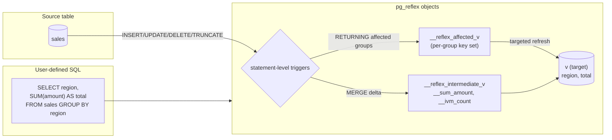

# Architecture



## Three tables per IMV

For an aggregate IMV, pg_reflex maintains three tables:

| Table | Purpose | Storage |
|---|---|---|
| `__reflex_intermediate_<view>` | Partial aggregates (`__sum_x`, `__count_x`, `__min_x`, etc.) plus `__ivm_count` | UNLOGGED by default; LOGGED when `storage='LOGGED'` |
| `__reflex_affected_<view>` | Set of group keys touched by the most recent flush | UNLOGGED; persistent (`TRUNCATE`d per flush, not `DROP`+`CREATE`) |
| `<view>` | User-facing target table (the one your queries SELECT from) | UNLOGGED by default |

For a passthrough IMV (no aggregation), only the target table exists.

## Per-source triggers

For each source table referenced in the IMV's `FROM` / `JOIN` list, pg_reflex installs four statement-level triggers:

```
__reflex_trigger_ins_on_<source>     AFTER INSERT
__reflex_trigger_del_on_<source>     AFTER DELETE
__reflex_trigger_upd_on_<source>     AFTER UPDATE
__reflex_trigger_trunc_on_<source>   AFTER TRUNCATE
```

These triggers are **shared across all IMVs on the same source** — adding a second IMV doesn't add a second set of triggers. Each trigger body looks up the IMV registry, computes the delta, and applies it.

## Sufficient statistics

Instead of storing raw rows, the intermediate table stores the **minimum state needed to maintain each aggregate**:

| User wrote | Intermediate stores | Target computes |
|---|---|---|
| `SUM(x)` | `__sum_x` (NUMERIC), `__nonnull_count_x` (BIGINT) | `CASE WHEN __nonnull_count_x > 0 THEN __sum_x END` |
| `COUNT(x)` | `__count_x` (BIGINT) | `__count_x` |
| `COUNT(*)` | `__count_star` (BIGINT) | `__count_star` |
| `AVG(x)` | `__sum_x` + `__count_x` | `__sum_x / NULLIF(__count_x, 0)` |
| `MIN(x)` | `__min_x` (source type) | `__min_x` |
| `MAX(x)` | `__max_x` (source type) | `__max_x` |
| `BOOL_OR(x)` | `__bool_or_x_true_count` + `__bool_or_x_nonnull_count` (1.1.3+, algebraic) | `CASE WHEN nonnull > 0 THEN true_count > 0 END` |
| `DISTINCT col` | `col` + `__ivm_count` | `col WHERE __ivm_count > 0` |
| `MIN(x)` with `topk=K` (1.3.0) | `__min_x` + `__min_x_topk <type>[K]` | `__min_x_topk[1]` (or `__min_x` post-recompute) |

`__ivm_count` tracks how many source rows contribute to each group. Groups whose `__ivm_count` drops to 0 are excluded from the target — they're soft-deleted.

## Dependency graph

IMVs can depend on other IMVs. pg_reflex tracks this via `graph_depth` and `graph_child` columns:

```sql
-- Depth 1: depends on a base table
SELECT create_reflex_ivm('daily_totals',
    'SELECT date, SUM(amount) AS total FROM sales GROUP BY date');

-- Depth 2: depends on daily_totals (an IMV)
SELECT create_reflex_ivm('monthly_totals',
    'SELECT date_trunc(''month'', date) AS month, SUM(total) AS grand
     FROM daily_totals GROUP BY date_trunc(''month'', date)');
```

Cascading propagation is automatic: when `daily_totals` updates its target, PostgreSQL fires `monthly_totals`'s triggers. Tested up to 4 levels.

## Modes

| Mode | Behaviour |
|---|---|
| `IMMEDIATE` (default) | Each `INSERT`/`UPDATE`/`DELETE` statement triggers a per-IMV flush before the surrounding transaction commits. |
| `DEFERRED` | Deltas are accumulated into `__reflex_deferred_pending` and flushed at `COMMIT` via a deferred constraint trigger, or manually via `reflex_flush_deferred(source)`. |

[Sufficient statistics deep dive :material-arrow-right-bold:](sufficient-statistics.md){ .md-button }
[Decomposition (CTE / UNION / WINDOW) :material-arrow-right-bold:](decomposition.md){ .md-button }
