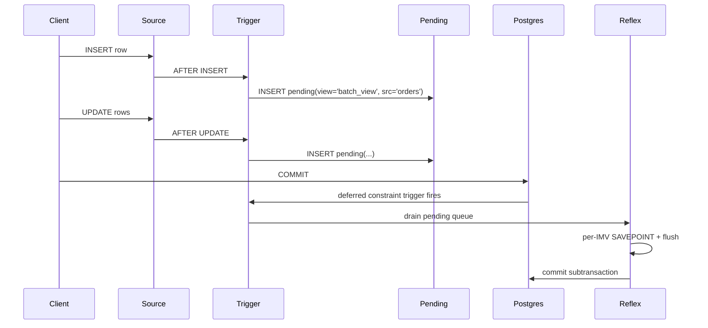

# Deferred mode

Two refresh modes exist:

| `mode` | When the flush runs | Best for |
|---|---|---|
| `IMMEDIATE` (default) | After each `INSERT` / `UPDATE` / `DELETE` statement | Low-latency reads against the IMV |
| `DEFERRED` | At `COMMIT` (or on-demand via `reflex_flush_deferred(source)`) | Bulk loads, batched writes, multi-statement transactions where you only need consistency at COMMIT |

## Creating a DEFERRED IMV

```sql
SELECT create_reflex_ivm('batch_view',
    'SELECT region, SUM(amount) AS total FROM orders GROUP BY region',
    NULL,                -- unique_columns
    'UNLOGGED',          -- storage
    'DEFERRED'           -- mode
);
```

## Behaviour

In DEFERRED mode, each `INSERT/UPDATE/DELETE` writes a marker into `__reflex_deferred_pending` instead of running the MERGE. A `deferred constraint trigger` drains the queue at COMMIT time:



Each per-IMV flush is wrapped in its own `SAVEPOINT` (since 1.2.0) — a single bad IMV records its `last_error` and lets the cascade continue.

## Manual flush

Call `reflex_flush_deferred(source_table)` to drain a source's pending queue without waiting for COMMIT:

```sql
INSERT INTO orders ...;
SELECT reflex_flush_deferred('orders');
SELECT * FROM batch_view;  -- already updated
```

## Tradeoffs

- **Pros**: deltas coalesce — many writes against the same group fold into a single MERGE. Lower aggregate cost on bulk loads.
- **Cons**: commit-time latency spikes proportionally to cascade width. Reads issued mid-transaction see stale results.

The audit (R4) flags DEFERRED as a latency concern, not a correctness one — keep cascades narrow when commit latency matters.

[See the runbook entry for slow cascades :material-arrow-right-bold:](../operations/runbook.md){ .md-button }
