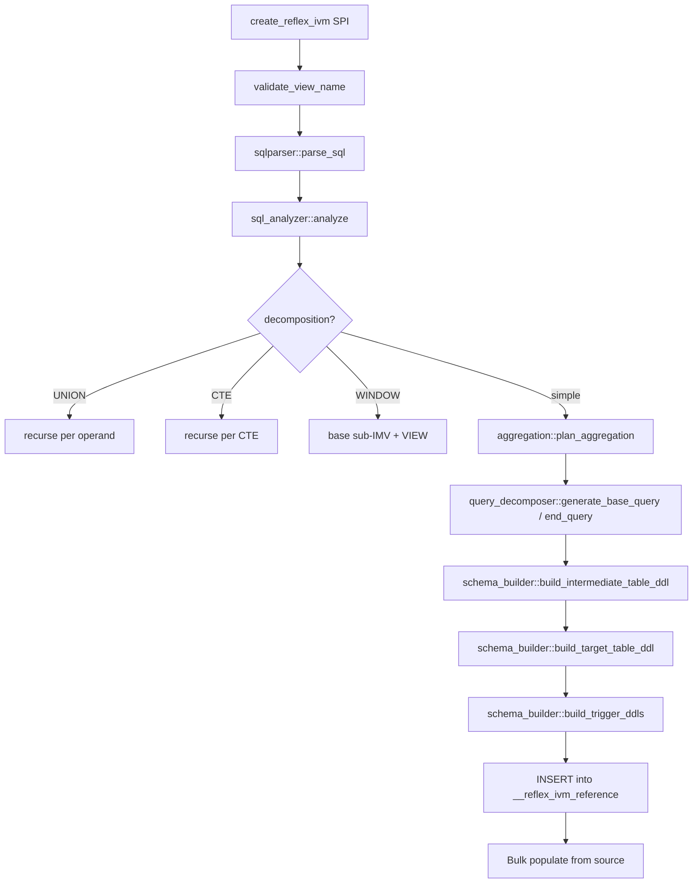
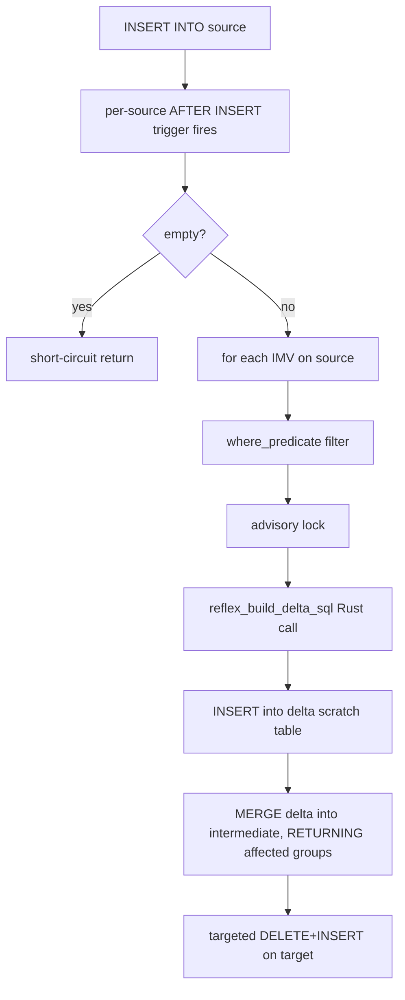

# Architecture tour

Map of `src/` for new contributors.

## Top-level

```
src/
├── lib.rs                  # Extension entry point: pg_extern wrappers + bootstrap SQL + event triggers
├── create_ivm.rs           # create_reflex_ivm_impl: parse → analyse → plan → DDL → register
├── drop_ivm.rs             # drop_reflex_ivm_impl: cascade-aware artifact cleanup
├── reconcile.rs            # reflex_reconcile + reflex_scheduled_reconcile + refresh_imv_depending_on
├── introspect.rs           # reflex_ivm_status / reflex_ivm_stats / reflex_explain_flush / reflex_ivm_histogram
├── sql_analyzer.rs         # Parse SQL → SqlAnalysis: extract GROUP BY, aggregates, JOINs, WHERE, sources
├── aggregation.rs          # SqlAnalysis → AggregationPlan: map user aggregates to sufficient statistics
├── query_decomposer.rs     # AggregationPlan → base_query (source→intermediate) + end_query (intermediate→target)
├── schema_builder.rs       # AggregationPlan → DDL: tables, indexes, triggers
├── trigger.rs              # reflex_build_delta_sql + reflex_flush_deferred — the runtime delta engine
├── window.rs               # Window-function decomposition: base sub-IMV + VIEW
└── tests/                  # 8 #[pg_test] integration files + 6 unit test files + proptest
```

## End-to-end flow on `create_reflex_ivm`



## End-to-end flow on a source `INSERT`



## Key invariants

- **Per-IMV advisory lock keys** are derived from `(hashtext(name), hashtext(reverse(name)))` — collision-free across distinct names.
- **`__ivm_count`** in the intermediate tracks contributing source rows; groups with `__ivm_count = 0` are excluded from the target.
- **Triggers are shared**: a second IMV on the same source piggybacks on existing triggers; the trigger function looks up all IMVs from `__reflex_ivm_reference`.
- **Per-IMV SAVEPOINT** in `reflex_flush_deferred`: each IMV's body runs in its own subtransaction so a failing IMV doesn't abort the cascade.
- **`__reflex_array_subtract_multiset(anyarray, anyarray)`** is a `LANGUAGE plpgsql IMMUTABLE PARALLEL SAFE` polymorphic helper used by the top-K MERGE codegen.

## Test organisation

- **Unit tests** (`src/tests/unit_*.rs`) — pure-Rust, test SQL-string generation. No PostgreSQL backend needed.
- **Integration tests** (`src/tests/pg_test_*.rs`) — `#[pg_test]` runs each test inside an embedded Postgres via pgrx. Every correctness test uses `assert_imv_correct` (the EXCEPT-ALL oracle).
- **Proptest** (`src/tests/unit_proptest.rs`) — random query shapes asserted against the oracle.
