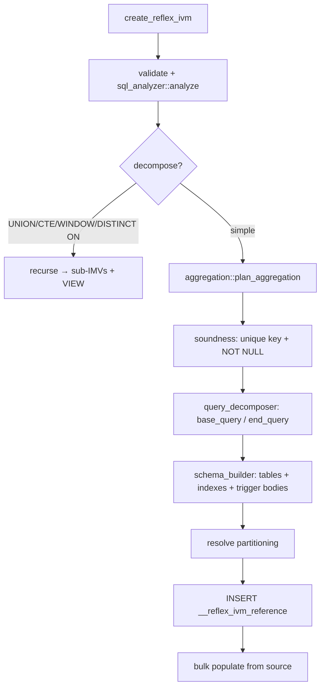
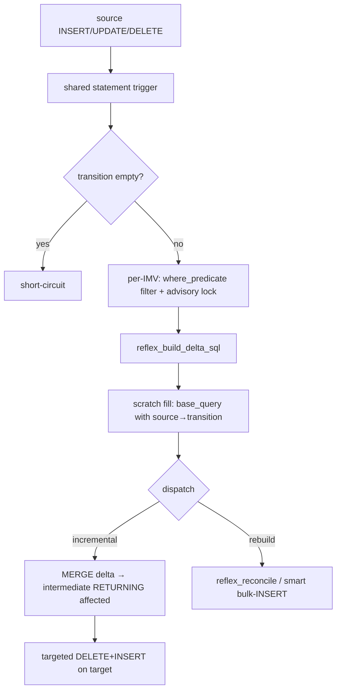

# Architecture tour

A contributor-level walkthrough of how pg_reflex is built: the module layout,
the two pipelines (create-time and maintenance-time), the runtime dispatch
strategy, and the invariants that keep results correct.

For the *user-facing* "what objects exist" view see
[Concepts → Architecture](../concepts/architecture.md); for *PostgreSQL-level
behaviour* (HOT, vacuum, locks, partition swap) see
[Concepts → Internals](../concepts/internals.md). This page is the bridge
between those and the source.

## The one mental model

**Rust here is a code generator, not a compute engine.** pg_reflex builds
strings of SQL and hands them to PostgreSQL to execute. Joins, aggregates and
`MERGE` run inside Postgres's C executor — independent of this Rust code. Almost
everything you'll read in `src/` is either *analysing* a query (at create time)
or *building SQL strings* (at maintenance time). The data itself never enters
Rust: maintenance operates on PG-native transition tables referenced by name in
generated SQL.

## Map of `src/`

```
src/
├── lib.rs                  # Extension entry point: #[pg_extern] wrappers, bootstrap SQL, event triggers
│
├── create_ivm/             # CREATE-time: turn a SELECT into a maintained IMV (runs once per IMV)
│   ├── mod.rs              #   validate → the BuildContext pipeline → create_reflex_ivm_impl; partition resolution + auto-mirror
│   ├── decompose.rs        #   split UNION / INTERSECT / EXCEPT / DISTINCT ON / window / CTE queries into sub-IMVs
│   ├── soundness.rs        #   unique-key + NOT-NULL inference (correctness-critical; most bug fixes land here)
│   └── admin.rs            #   reflex_compact_imv / reflex_rebuild_* maintenance commands
│
├── trigger/                # MAINTENANCE-time: the runtime delta engine (the hot path)
│   ├── mod.rs              #   reflex_build_delta_sql dispatcher + delta-SQL cache + DeltaOp + name/truncate/path-c helpers
│   ├── merge.rs            #   MERGE + MIN/MAX recompute SQL builders, null_safe_in
│   ├── dispatch.rs         #   selectivity & partition dispatch (Path B/C), bulk INSERT / bulk DELETE
│   ├── ops.rs              #   per-operation INSERT/DELETE/UPDATE codegen, self-join + outer-join + passthrough arms
│   └── deferred.rs         #   reflex_flush_deferred (COMMIT-time batched flush; per-source lock; per-IMV SAVEPOINT)
│
├── sql_analyzer.rs         # Parse SQL → SqlAnalysis: GROUP BY, aggregates, JOINs, WHERE, sources, set-ops
├── aggregation.rs          # SqlAnalysis → AggregationPlan: map user aggregates to sufficient statistics; source_join_keys
├── query_decomposer.rs     # AggregationPlan → base_query (source→intermediate) + end_query (intermediate→target); name helpers
├── schema_builder.rs       # AggregationPlan → DDL: intermediate/target tables, indexes, the plpgsql trigger bodies
├── window.rs               # Window-function decomposition: base sub-IMV + VIEW
├── reconcile.rs            # reflex_reconcile / reflex_scheduled_reconcile / refresh_imv_depending_on (full rebuild + cascade)
├── partition.rs            # Declarative partitioning: introspect, sync, per-child atomic DETACH/ATTACH swap
├── drop_ivm.rs             # drop_reflex_ivm_impl: cascade-aware artifact cleanup
├── introspect.rs           # reflex_ivm_status / reflex_ivm_stats / reflex_explain_flush / reflex_ivm_histogram
├── audit/                  # Consistency / drift checks (catastrophic, drift, orphan)
└── tests/                  # 23 #[pg_test] integration files + 8 unit-test files + proptest
```

`create_ivm/` and `trigger/` were split out of single 4.6k / 3.5k-line files in
2026-06. The split is a pure move: each submodule opens with `use super::*;` and
the parent `mod.rs` re-exports via `pub(crate) use <submodule>::*;`, so every
existing call path is unchanged. Rule of thumb: **`create_ivm/` sets an IMV up,
`trigger/` keeps it updated.**

## The data model (what gets built)

For an **aggregate** IMV, three tables (see
[Concepts → Architecture](../concepts/architecture.md) for the full table):

- `__reflex_intermediate_<view>` — partial/sufficient statistics per group
  (`__sum_x`, `__count_x`, `__min_x`, …) plus `__ivm_count` (rows contributing
  to the group; 0 ⇒ soft-deleted).
- `__reflex_affected_<view>` — the set of group keys touched by the current
  flush (captured via `MERGE … RETURNING`); drives the targeted target refresh.
- `<view>` — the user-facing target table, projected from the intermediate.

A **passthrough** IMV (no aggregation) has only the target table.

Two derived SQL strings are stored in the catalog (`__reflex_ivm_reference`) and
are the heart of maintenance:

- **`base_query`** — computes intermediate rows *from a source*. At fire time
  the source reference is swapped for a transition table, turning it into the
  delta.
- **`end_query`** — projects the target *from the intermediate*.

## Pipeline 1 — create (`create_ivm/`)

`create_reflex_ivm(view, sql, …)` → `create_reflex_ivm_impl` (`create_ivm/mod.rs`):

1. **Validate & parse** — `validate_view_name`, then `sqlparser` → `sql_analyzer::analyze` produces a `SqlAnalysis` (sources, GROUP BY, aggregates, JOINs, WHERE, set-ops).
2. **Decompose?** (`create_ivm/decompose.rs`) — if the query is a UNION/INTERSECT/EXCEPT, has a top-level DISTINCT ON, a window function, or CTEs, it is recursively materialised as **sub-IMVs** with a `CREATE VIEW` (or wrapper IMV) on top. Each operand/CTE becomes its own maintained IMV. Otherwise continue with the simple plan.
3. **Plan** — `aggregation::plan_aggregation` maps each user aggregate to its sufficient statistics → `AggregationPlan`.
4. **Infer soundness** (`create_ivm/soundness.rs`) — resolve the unique key (explicit `unique_columns`, else PK/equi-join inference) and the NOT-NULL column set. These gate which incremental strategies are *correct* for this IMV; getting them wrong is the classic silent-data-loss bug class, which is why they live in their own module with the densest test coverage.
5. **Generate SQL** — `query_decomposer::generate_base_query` / `generate_end_query` build `base_query` / `end_query`.
6. **Build DDL** (`schema_builder.rs`) — intermediate + target tables, indexes (`UNIQUE … NULLS NOT DISTINCT`, hash for single-key), and the plpgsql **trigger bodies**. The four statement-level triggers are installed per source (shared across all IMVs on that source).
7. **Resolve partitioning** (`create_ivm/mod.rs`) — explicit `partition_by` or auto-mirror from a partitioned source.
8. **Register** — one row into `__reflex_ivm_reference` (`base_query`, `end_query`, `aggregations` JSON, `depends_on`, `graph_depth`, …).
9. **Populate** — bulk-fill intermediate + target from the source.


```mermaid
flowchart TD
    A[create_reflex_ivm] --> B[validate + sql_analyzer::analyze]
    B --> C{decompose?}
    C -->|UNION/CTE/WINDOW/DISTINCT ON| D[recurse → sub-IMVs + VIEW]
    C -->|simple| E[aggregation::plan_aggregation]
    E --> F[soundness: unique key + NOT NULL]
    F --> G[query_decomposer: base_query / end_query]
    G --> H[schema_builder: tables + indexes + trigger bodies]
    H --> I[resolve partitioning]
    I --> J[INSERT __reflex_ivm_reference]
    J --> K[bulk populate from source]
```

## Pipeline 2 — maintenance (`trigger/`)

A source DML statement fires a shared statement-level trigger (reading PG
transition tables, so once per statement, not per row). The trigger body calls
**`reflex_build_delta_sql`** (`trigger/mod.rs`) — the dispatcher — which returns
a delimiter-separated string of SQL the plpgsql body then `EXECUTE`s.

`reflex_build_delta_sql` decides, in order:

1. **Cache** — a content-addressed cache keyed on `(view, source, op, base_query, end_query, aggregations)`; identical inputs reuse the built SQL.
2. **Shape** — self-join? outer-join-secondary? passthrough vs aggregate? Each routes to a different arm in `trigger/ops.rs`.
3. **Operation** — INSERT / DELETE / UPDATE. UPDATE is two-phase (subtract OLD, add NEW); Item α may *promote* a directional filter flip to `INSERT_PROMOTED` / `DELETE_PROMOTED`.
4. **Delta SQL** — `trigger/merge.rs` builds the `MERGE` that applies the delta to the intermediate (`+` for add, `−` for subtract) `RETURNING` affected groups; MIN/MAX use scoped recompute.
5. **Target refresh** — only affected groups are deleted + re-inserted into the target from the intermediate.


```mermaid
flowchart TD
    A[source INSERT/UPDATE/DELETE] --> B[shared statement trigger]
    B --> C{transition empty?}
    C -->|yes| Z[short-circuit]
    C -->|no| D[per-IMV: where_predicate filter + advisory lock]
    D --> E[reflex_build_delta_sql]
    E --> F[scratch fill: base_query with source→transition]
    F --> G{dispatch}
    G -->|incremental| H[MERGE delta → intermediate RETURNING affected]
    G -->|rebuild| R[reflex_reconcile / smart bulk-INSERT]
    H --> I[targeted DELETE+INSERT on target]
```

### The dispatch decision (when to incrementally update vs rebuild)

Incremental `MERGE` is fast when few groups change; a full/partition rebuild
wins on bulk flips. pg_reflex chooses between them (`trigger/dispatch.rs`):

- **Post-scratch selectivity** (`build_high_selectivity_dispatch_sql`) — a per-IMV `DO` block compares `affected / intermediate_rows` against `wipe_threshold` (default 0.5). Over threshold → `reflex_reconcile`; under → `MERGE` + `ANALYZE` + targeted refresh. The `ANALYZE` between MERGE and target sync is mandatory (stale stats → catastrophic target-DELETE plans).
- **Path B** (pre-scratch) — `|transition| / |source|`; routes huge sweeping DML to reconcile *before* paying the scratch-fill JOIN.
- **Path C** (pre-scratch, UPDATE `INSERT_PROMOTED` only) — `EXPLAIN`-based planner row estimate via `reflex_build_path_c_explain_sql` (`trigger/mod.rs`); catches the dim-flip fanout case and dispatches to a *smart bulk-INSERT* (`push_bulk_insert_and_affected`, `trigger/dispatch.rs`) that adds only new keys.
- **Partition-aware** (`build_partition_aware_dispatch_sql`, `trigger/dispatch.rs`) — for partitioned LIST IMVs, classifies partitions hot/cold and per-partition atomically swaps the hot ones.

Full PG-level detail (lock windows, the `ANALYZE` rationale, the bulk-INSERT
SQL) is in [Concepts → Internals](../concepts/internals.md).

### Deferred mode (`trigger/deferred.rs`)

In `DEFERRED` mode the per-statement work is replaced by accumulation into
`__reflex_deferred_pending`; a deferred constraint trigger (or manual
`reflex_flush_deferred(source)`) drains it at COMMIT. The flush takes a
per-source serialisation advisory lock (`reflex_flush:<source>`) and wraps each
IMV's drain in its own `SAVEPOINT`, so one failing IMV doesn't abort the whole
cascade.

## Key invariants

- **`__ivm_count`** tracks contributing source rows; a group at 0 is excluded
  from the target (soft delete).
- **Triggers are shared** per source; a second IMV piggybacks on existing
  triggers — the body looks up all IMVs from `__reflex_ivm_reference`.
- **Per-IMV advisory lock key** = `(hashtext(name), hashtext(reverse(name)))` —
  collision-free across distinct names (`trigger/deferred.rs`).
- **No `--` SQL comments inside generated trigger bodies** — the body is
  concatenated to one line; a `--` swallows the rest. Use Rust `//` comments.
- **Identifier quoting must match what `end_query` stores** — it always emits
  `"schema"."table"`; a `format('%I.%I', …)` that drops quotes makes
  `REPLACE(end_query, …)` silently fail.

## Cascading

IMVs can depend on IMVs (`graph_depth`, `graph_child`, `depends_on_imv`). When an
IMV updates its target table, PostgreSQL fires the downstream IMV's triggers —
cascading propagation is automatic to arbitrary depth.

## Test organisation

- **Unit tests** (`src/tests/unit_*.rs`) — pure-Rust, test SQL-string
  generation; no PostgreSQL backend.
- **Integration tests** (`src/tests/pg_test_*.rs`) — `#[pg_test]` runs each test
  inside an embedded Postgres via pgrx. Correctness tests use the EXCEPT-ALL
  oracle (`assert_imv_correct`).
- **Proptest** (`src/tests/unit_proptest.rs`) and the differential fuzz harness
  (`src/tests/pg_test_fuzz.rs`) — random query shapes / mutation sequences
  asserted against the oracle.

Quick onboarding map (for engineers new to Rust): see the repository-root
`ARCHITECTURE.md` (the Maintainer's Map).
