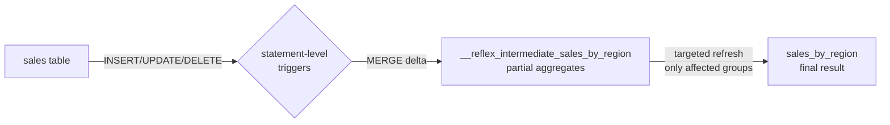

# Your first IMV

A 60-second walkthrough.

## 1. A source table

```sql
CREATE TABLE sales (
    id SERIAL PRIMARY KEY,
    region TEXT NOT NULL,
    amount NUMERIC NOT NULL
);
INSERT INTO sales (region, amount) VALUES
    ('US', 100), ('US', 200), ('EU', 150);
```

## 2. Create the IMV

```sql
SELECT create_reflex_ivm(
    'sales_by_region',
    'SELECT region, SUM(amount) AS total FROM sales GROUP BY region'
);
```

What pg_reflex does behind the scenes:

1. Parses your SQL with `sqlparser`.
2. Plans a sufficient-statistics decomposition (`SUM(x)` → `__sum_x` running tally).
3. Creates an **intermediate** UNLOGGED table with the partial aggregates.
4. Creates a **target** table named `sales_by_region` with the user-facing columns.
5. Installs row-level triggers on `sales` for INSERT / UPDATE / DELETE / TRUNCATE.
6. Bulk-populates the intermediate + target from the current source rows.

## 3. Read it like a regular table

```sql
SELECT * FROM sales_by_region;
--  region | total
-- --------+-------
--  US     |   300
--  EU     |   150
```

## 4. Insert and watch it update — no REFRESH

```sql
INSERT INTO sales (region, amount) VALUES ('US', 50), ('EU', 200);

SELECT * FROM sales_by_region;
--  region | total
-- --------+-------
--  US     |   350
--  EU     |   350
```

DELETEs and UPDATEs propagate the same way:

```sql
DELETE FROM sales WHERE amount = 100;
SELECT * FROM sales_by_region;
--  region | total
-- --------+-------
--  US     |   250
--  EU     |   350
```

## What just happened?



Each `INSERT` / `UPDATE` / `DELETE` fires a statement-level trigger that:

1. Computes a **delta** from the transition table (the `NEW`/`OLD` rows).
2. `MERGE`s the delta into the intermediate table (additive aggregates use `+`/`-`).
3. Captures the affected group keys via `MERGE ... RETURNING`.
4. Re-materialises **only those groups** from intermediate → target.

[Read the architecture :material-arrow-right-bold:](../concepts/architecture.md){ .md-button .md-button--primary }
[See more aggregates :material-arrow-right-bold:](../sql-reference/aggregates.md){ .md-button }
